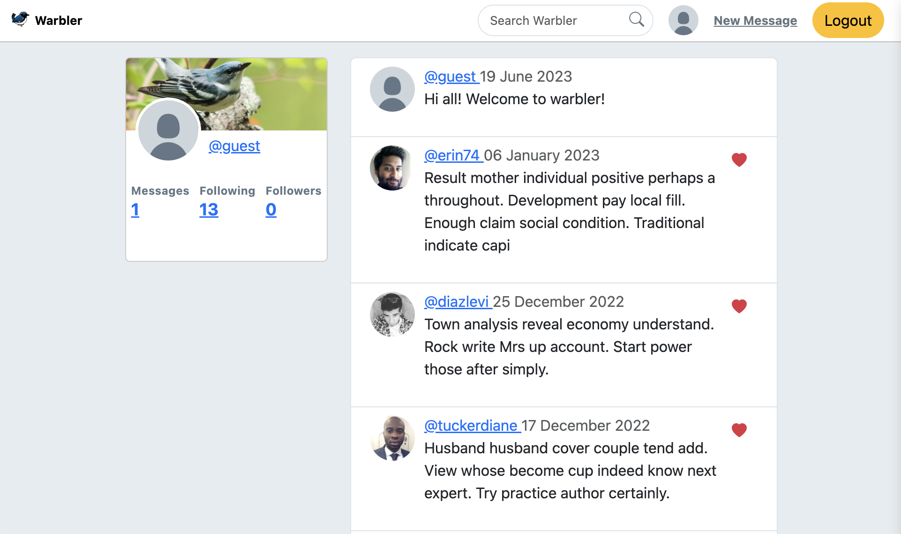

# Warbler

> This is a full stack social media app where users can view messages, post messages, and  like one another's posts. Users can follow one another, and only view messages from users that they follow.

<br />
<!-- PROJECT LOG -->
<div align="center">
  <p align="center">
    <a href="https://github.com/ari-denary/warbler"><strong>Explore the docs »</strong></a>
    <br />
    <a href="https://github.com/ari-denary/warbler">View Demo</a>
    ·
    <a href="https://github.com/ari-denary/warbler/issues">Report Bug</a>
    ·
    <a href="https://github.com/ari-denary/warbler/issues">Request Feature</a>
  </p>
</div>

<br />

[![Contributors][contributors-shield]][contributors-url]
[![Forks][forks-shield]][forks-url]
[![Stargazers][stars-shield]][stars-url]
[![Issues][issues-shield]][issues-url]
[![MIT License][license-shield]][license-url]


<br />
<!-- TABLE OF CONTENTS -->
<details>
  <summary>Table of Contents</summary>
  <ol>
    <li><a href="#built-with">Built With</a></li>
    <li><a href="#getting-started">Getting Started</a></li>
    <li><a href="#usage">Usage</a></li>
    <li><a href="#roadmap">Roadmap</a></li>
    <li><a href="#contributing">Contributing</a></li>
    <li><a href="#license">License</a></li>
    <li><a href="#contact">Contact</a></li>
    <li><a href="#acknowledgments">Acknowledgments</a></li>
  </ol>
</details>

<br />

## Built With

* [![Flask][Flask.com]][Flask-url]

<p align="right">(<a href="#warbler">back to top</a>)</p>


<!-- GETTING STARTED -->
## Getting Started

- **Note: Please be patient, render is slow to load.**

- Deployed on:
- **Username: guest**
- **Password: password**

1. Navigate to `app/`. Create virtual environment and activate.

```shell
cd app/
python3 -m venv venv
source venv/bin/activate
```

2. Install dependencies.

```shell
pip3 install -r requirements.txt
```

3. Run app
```shell
python3 -m flask run -p 5000
```

<p align="right">(<a href="#warbler">back to top</a>)</p>


<!-- USAGE EXAMPLES -->
## Usage

- Homepage to view all messages from followed users:


<p align="right">(<a href="#warbler">back to top</a>)</p>

## Tests

To run tests:

```python
FLASK_DEBUG=False python -m unittest test_filename.py
```

<!-- ROADMAP -->
## Roadmap

- [ ] Add nav link to see posts from all users

See the [open issues](https://github.com/ari-denary/warbler/issues) for a full list of proposed features (and known issues).

<p align="right">(<a href="#warbler">back to top</a>)</p>


<!-- CONTRIBUTING -->
## Contributing

Contributions are what make the open source community such an amazing place to learn, inspire, and create. Any contributions you make are **greatly appreciated**.

If you have a suggestion that would make this better, please fork the repo and create a pull request. You can also simply open an issue with the tag "enhancement".
Don't forget to give the project a star! Thanks again!

1. Fork the Project
2. Create your Feature Branch (`git checkout -b feature/AmazingFeature`)
3. Commit your Changes (`git commit -m 'Add some AmazingFeature'`)
4. Push to the Branch (`git push origin feature/AmazingFeature`)
5. Open a Pull Request

<p align="right">(<a href="#warbler">back to top</a>)</p>


<!-- LICENSE -->
## License

Distributed under the MIT License. See `LICENSE.txt` for more information.

<p align="right">(<a href="#warbler">back to top</a>)</p>


<!-- CONTACT -->
## Contact

Ari Denary - [adenary.dev@gmail.com](mailto:adenary.dev@gmail.com) - [LinkedIn][linkedin-url]


Project Link: [https://github.com/ari-denary/warbler](https://github.com/ari-denary/warbler)

<p align="right">(<a href="#warbler">back to top</a>)</p>


<!-- ACKNOWLEDGMENTS -->
## Acknowledgments

* [Co-creator: Terry Li](https://github.com/terrysli)

<p align="right">(<a href="#warbler">back to top</a>)</p>


<!-- MARKDOWN LINKS & IMAGES -->
<!-- https://www.markdownguide.org/basic-syntax/#reference-style-links -->
[contributors-shield]: https://img.shields.io/github/contributors/ari-denary/warbler.svg?style=for-the-badge
[contributors-url]: https://github.com/ari-denary/warbler/graphs/contributors
[forks-shield]: https://img.shields.io/github/forks/ari-denary/warbler.svg?style=for-the-badge
[forks-url]: https://github.com/ari-denary/warbler/network/members
[stars-shield]: https://img.shields.io/github/stars/ari-denary/warbler.svg?style=for-the-badge
[stars-url]: https://github.com/ari-denary/warbler/stargazers
[issues-shield]: https://img.shields.io/github/issues/ari-denary/warbler.svg?style=for-the-badge
[issues-url]: https://github.com/ari-denary/warbler/issues
[license-shield]: https://img.shields.io/badge/License-MIT-41acc0?style=for-the-badge&logo=MIT&logoColor=white
[license-url]: https://github.com/ari-denary/warbler/LICENSE.txt
[linkedin-shield]: https://img.shields.io/badge/-LinkedIn-black.svg?style=for-the-badge&logo=linkedin&colorB=555
[linkedin-url]: https://linkedin.com/in/ari-denary/
<!-- [product-screenshot]: images/screenshot.png -->
[Flask.com]: https://shields.io/badge/Flask-41acc0?style=for-the-badge&logo=flask&logoColor=white
[Flask-url]: https://flask.palletsprojects.com/